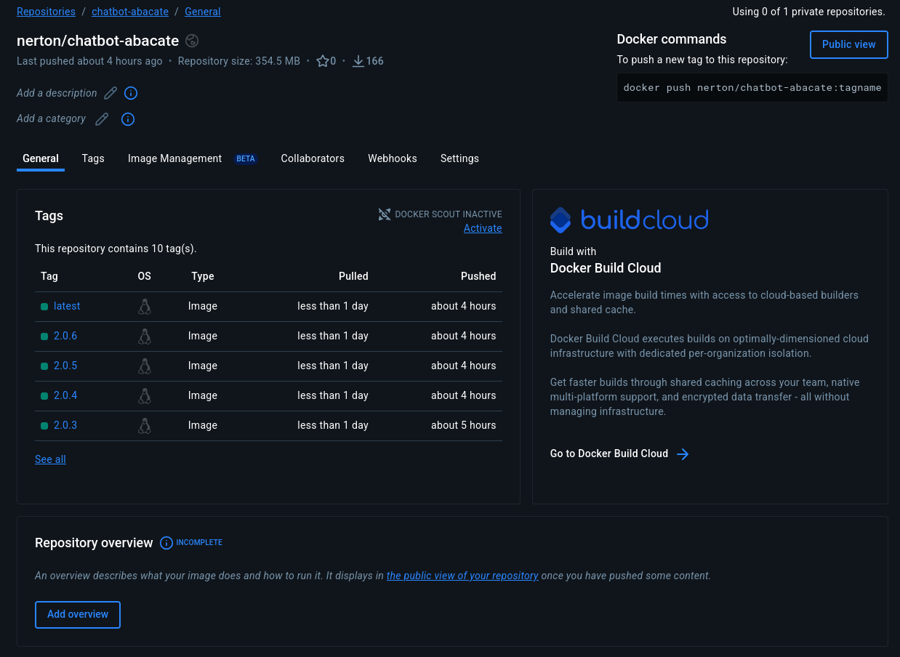
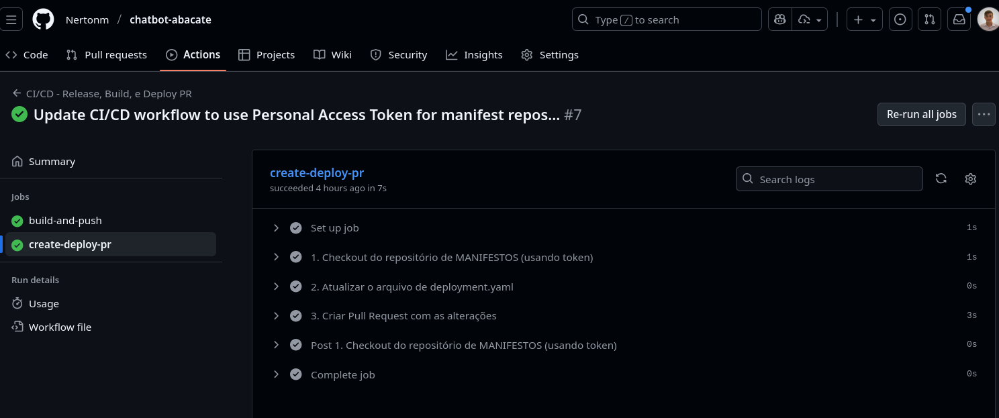
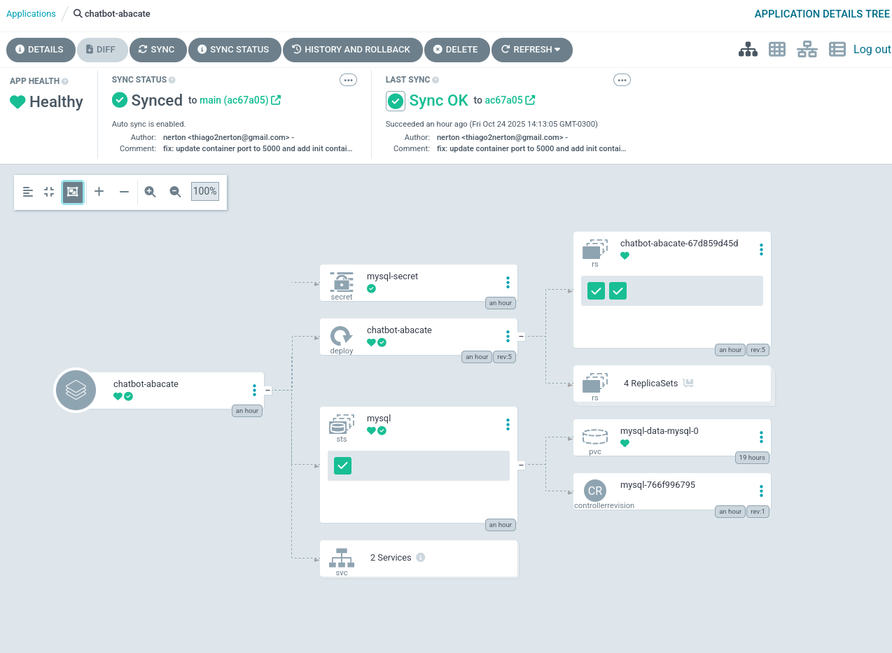
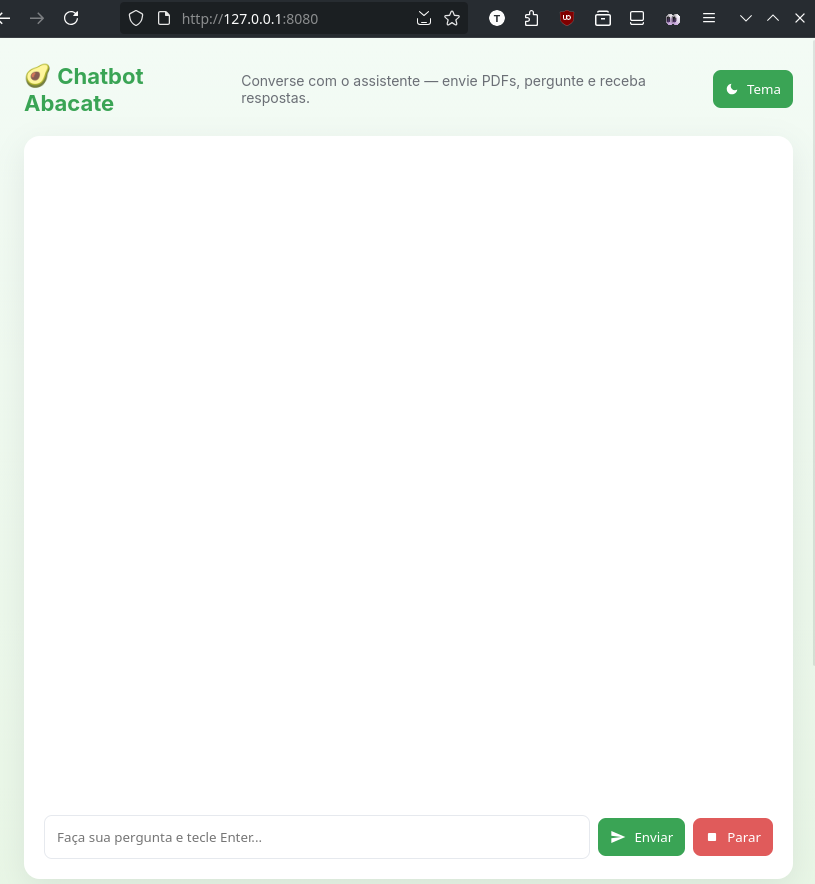

# Chatbot Abacate

[](https://github.com/Nertonm/chatbot-abacate/actions/workflows/ci-cd.yaml) [](https://hub.docker.com/r/nerton/chatbot-abacate) [](https://hub.docker.com/r/nerton/chatbot-abacate) [](https://www.python.org/) [](LICENSE)

Aplicação web em FastAPI que utiliza um modelo de linguagem (OpenAI) e persiste interações em um banco MySQL. O repositório inclui configuração para execução local (Docker/Docker Compose) e uma pipeline de CI/CD via GitHub Actions que automatiza a construção/publicação da imagem Docker e a atualização de manifestos de implantação (GitOps).

## Principais Tecnologias

  * **Aplicação:** FastAPI (Python 3.9+)
  * **Banco de Dados:** MySQL
  * **Containerização:** Docker & Docker Compose
  * **CI/CD:** GitHub Actions (Build, Push e PR para GitOps)
  * **Libs Principais:** Uvicorn, SQLAlchemy, PyMySQL, OpenAI, PyMuPDF

## Estrutura do Projeto

Este repositório foca no código da aplicação e na pipeline de CI:

```
app/
    ├─ main.py        # Entrada da app FastAPI
    ├─ chat.py        # Lógica de integração com OpenAI
    ├─ models.py      # Modelos SQLAlchemy
    ├─ utils.py       # Utilitários (ex: extração de texto de PDF)
    ├─ config.py      # Configurações/variáveis de ambiente
    └─ templates/     # Frontend simples (index.html)
.github/
    └─ workflows/
         └─ ci-cd.yaml # Workflow (CI)
Dockerfile
docker-compose.yml
requirements.txt
scripts/           # Scripts de inicialização (ex.: wait-for-db.sh)
README.md
```

## Pipeline de CI/CD (GitHub Actions)

Resumo: a pipeline é acionada por um push de tag semântica (ex.: `v1.2.0`) e possui dois jobs principais:

1) build-and-push
    - Faz checkout do código
    - Autentica no Docker Hub usando `DOCKER_USER` e `DOCKER_PASSWORD`
    - Extrai a tag semântica da referência Git
    - Constrói a imagem Docker com o `Dockerfile` e publica no Docker Hub (ex.: `docker.io/<user>/chatbot-abacate:v1.2.0`)

2) create-deploy-pr
    - Faz checkout de um repositório de manifestos definido em `MANIFESTS_REPO` (usando `MANIFESTS_TOKEN`)
    - Substitui a tag da imagem no manifesto (ex.: `deployment-app.yaml`) pela nova versão
    - Cria automaticamente um Pull Request no repositório de manifestos com a atualização

### Configurando a Pipeline (CI) em um Fork

1.  No seu repositório GitHub (`Settings` → `Secrets and variables` → `Actions`), adicione:
      * `DOCKER_USER`: Usuário do Docker Hub.
      * `DOCKER_PASSWORD`: Token de acesso do Docker Hub.
      * `MANIFESTS_TOKEN`: Personal Access Token (PAT) do GitHub com permissão `repo` para abrir PRs no repositório de manifestos.
2.  Ajuste (se necessário) `.github/workflows/ci-cd.yaml` para `IMAGE_NAME` e `MANIFESTS_REPO`.
3.  Para acionar, crie e envie uma tag:
    ```bash
    git tag v1.0.1
    git push origin v1.0.1
    ```

## Variáveis de ambiente

Este projeto usa variáveis de ambiente para configurar a integração com a OpenAI, conexão ao banco e comportamentos do app. Copie o arquivo `.env.example` para `.env` e ajuste os valores antes de rodar localmente ou em compose.

Principais variáveis explicadas:

- `OPENAI_API_KEY` — chave da OpenAI para chamadas à API.
- `DATABASE_URL` — string de conexão do SQLAlchemy (ex.: `mysql+pymysql://user:pass@db:3306/chatbot`).
- `IMAGE_NAME` — nome da imagem Docker usada pelo workflow (ex.: `nerton/chatbot-abacate`).
- `MANIFESTS_REPO` — repositório de manifestos para o job que cria o PR (ex.: `owner/manifests-repo`).
- `PORT` — porta onde a aplicação escuta (padrão `5000`).

Arquivo de exemplo criado: `.env.example`.

## Executando localmente (desenvolvimento)

### Opções:

#### A. Ambiente virtual Python (rápido para desenvolvimento)

1. Crie e ative um virtualenv:

```bash
python3 -m venv .venv
source .venv/bin/activate
pip install -r requirements.txt
```

2. Configure variáveis de ambiente (copie `.env.example` → `.env`) e preencha `OPENAI_API_KEY` e `DATABASE_URL` (ou configure um MySQL local).

3. Rode a aplicação:

```bash
uvicorn app.main:app --reload --port 5000
```

Acesse: http://localhost:5000

#### B. Docker Compose (recomendado para reproduzir ambiente com DB)

1. Atualize o arquivo `.env` com as credenciais necessárias (`OPENAI_API_KEY`, DB credentials). O serviço do DB usa o host `db` quando rodando via compose.
2. Construa e suba os containers:

```bash
docker-compose up --build -d
```

3. Verifique logs / health e acesse http://localhost:5000


# Deploy com GitOps (CD)

Este repositório é responsável pelo **CI** (Build da imagem). O **Continuous Deployment (CD)** é gerenciado pelo repositório de manifestos, que é consumido por uma ferramenta de GitOps como o ArgoCD.

Para instruções detalhadas sobre a implantação no Kubernetes e a configuração do ArgoCD, consulte o repositório de manifestos:

**➡️ [Nertonm/chatbot-manifests](https://github.com/Nertonm/chatbot-manifests)**

### Verificação

Considerando a implementação do ArgoCD apontando para o repositório de manifestos:
- Na UI do ArgoCD deverá constar a aplicação `chatbot-abacate`. Verifique o status de sincronização e os recursos criados no namespace destino.
- Se houver problemas, abra os eventos e logs dos pods (ex.: `kubectl -n argocd logs deploy/argocd-application-controller`).


## Evidências de Funcionamento

Esta seção reúne as evidências do pipeline CI/CD e da aplicação rodando no cluster.

### 1\. Build e Push no Docker Hub

  * **Link:** [hub.docker.com/r/nerton/chatbot-abacate](https://hub.docker.com/repository/docker/nerton/chatbot-abacate/general)
  * 

### 2\. Atualização Automática dos Manifestos (PR)

* 
* PR criado automaticamente com a atualização da tag da imagem Docker.

### 3\. ArgoCD Sincronizado
* Captura de tela do ArgoCD com a aplicação sincronizada


### 4\. Pods Rodando (`kubectl get pods`)

```bash
kubectl -n default get pods
NAME                               READY   STATUS    RESTARTS   AGE
chatbot-abacate-67d859d45d-jv552   1/1     Running   0          70m
chatbot-abacate-67d859d45d-t9q7h   1/1     Running   0          70m
mysql-0                            1/1     Running   0          68m
```

### 5\. Resposta da Aplicação (`curl` e Browser)

Saída do `curl` confirmando o `HTTP 200 OK` e o título da aplicação:

```bash
nerton@gaspar:~$ curl -v http://0.0.0.0:8080
* Trying 0.0.0.0:8080...
* Established connection to 0.0.0.0 (0.0.0.0 port 8080)
> GET / HTTP/1.1
> Host: 0.0.0.0:8080
> User-Agent: curl/8.16.0
> Accept: */*
> 
< HTTP/1.1 200 OK
< date: Fri, 24 Oct 2025 18:23:46 GMT
< server: uvicorn
< content-length: 19321
< content-type: text/html; charset=utf-8
< 
<!doctype html>
<html lang="pt-BR">
<head>
    <meta charset="utf-8">
    <meta name="viewport" content="width=device-width,initial-scale=1">
    <title>Chatbot Abacate</title>
...
* Connection #0 to host 0.0.0.0 left intact
```



## Troubleshooting Rápido

  * **App não conecta ao MySQL:** Verifique `DATABASE_URL` e se o serviço `db` está acessível (via compose ou `kubectl`).
  * **Erro de dependência:** Rode `pip install -r requirements.txt` em um venv limpo.
  * **Secrets do GitHub:** Confirme que os nomes e valores estão corretos (especialmente `MANIFESTS_TOKEN` com permissão `repo`).

## License

Licença: MIT — ver o arquivo `LICENSE`.